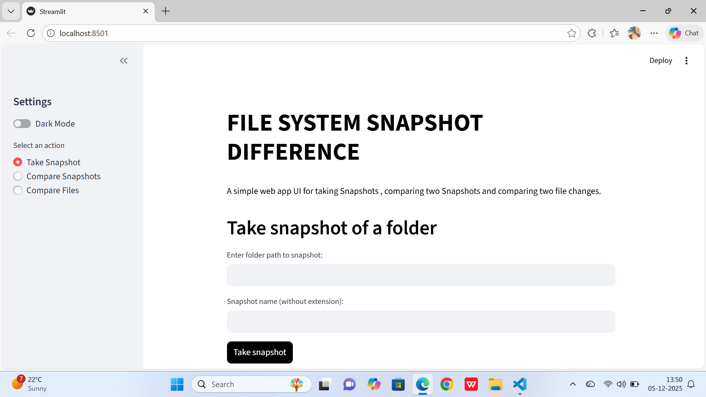
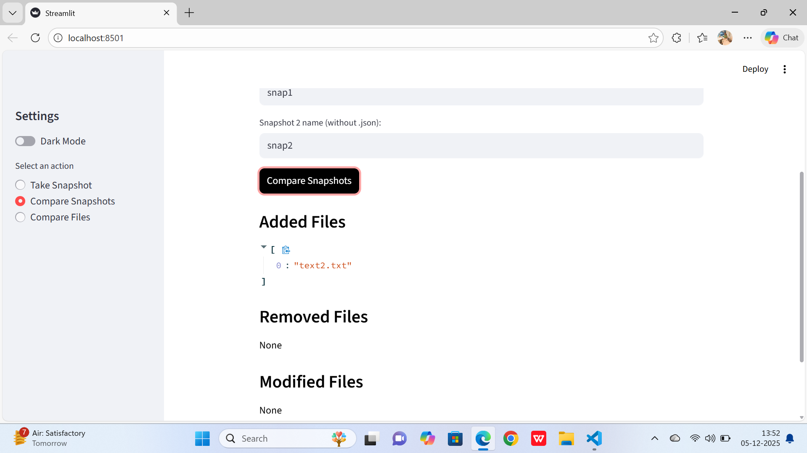

[](https://www.python.org/)
[](https://streamlit.io/)
[](LICENSE)

# 📁 File System Snapshot Difference

A **Python-based developer tool** that captures snapshots of a folder and compares them to detect **added, modified, and removed files**. The project includes a **Streamlit web UI** for easy interaction and a **Folder Statistics** feature that instantly previews folder details before creating snapshots.
This project was developed as part of an On-the-Job Training (OJT) program to understand file system behavior, hashing, and UI integration using Streamlit.

---

## 🚀 Features

### 1. File Snapshot Generation

* Captures a complete snapshot of a selected folder
* Stores file metadata (**file path + MD5 hash**) in a JSON file
* Helps track file-level changes across snapshot versions

### 2. Snapshot Comparison (Diff Tool)

Compares **Snapshot A** and **Snapshot B** to detect:

* 🟢 **Added Files** – Present in Snapshot B but not in Snapshot A
* 🟡 **Modified Files** – File content changed (detected via MD5 hash)
* 🔴 **Removed Files** – Present in Snapshot A but missing in Snapshot B

### 3. Folder Statistics (Automatic Preview)

As soon as the user enters a folder name in the Streamlit UI, the app automatically displays:

* 📄 Total Files
* 📁 Total Folders
* 🕒 Last Modified Time

This instant preview helps users understand the folder structure **before taking a snapshot**.

### 4. Streamlit Web UI

A clean and simple browser-based interface that allows users to:

* Enter a folder name → Automatically view folder statistics
* Enter a snapshot name → Generate a snapshot
* Select two snapshots → Compare and view differences
* Clearly view added, modified, and removed files

### 5. Snapshot History Table

* Displays all snapshots in a structured table
* Columns include:

  * Snapshot Name
  * Date & Time
  * Number of files in the folder
  * Confirmation checkbox (safe delete)
  * Delete button

This feature helps users easily track **which snapshots exist, when they were created, and safely delete them**.

---

## 📸 Screenshots

### Folder Statistics & Snapshot Creation


### Snapshot Comparison Output


## 🗂️ Project Structure

```text
FILE-SYSTEM-SNAPSHOT-DIFFERENCE/
│
├── folder/                 # Sample folder for testing
│
├── snapshots/              # Auto-generated snapshot JSON files
│
├── src/
│   ├── __pycache__/        # Cache files
│   ├── diff.py             # Snapshot comparison logic
│   ├── file_compare.py     # Line-by-line file comparison
│   ├── main.py             # Streamlit backend logic
│   └── snapshot.py         # Snapshot generation logic
│
├── app.py                  # Streamlit UI entry point
├── LICENSE
├── README.md
└── requirements.txt
```

---

## 🛠️ Tech Stack

* **Python 3**
* **Streamlit**
* **JSON**
* **Hashlib (MD5)**
* **OS Module**

---

## ▶️ How to Run the Project

### 1. Install Dependencies

```bash
pip install -r requirements.txt
```

### 2. Run the Streamlit App

```bash
streamlit run app.py
```

---

## 🧭 How to Use the Streamlit UI

### Step 1: View Folder Statistics (Automatic)

* Enter the folder name in the input field
* Press **Enter**
* The app automatically displays:

  * Total Files
  * Total Folders
  * Last Modified Time

### Step 2: Take a Snapshot

* Enter a snapshot name
* Click **Take Snapshot**
* A new snapshot JSON file is created inside the `snapshots/` folder

### Step 3: Compare Snapshots

* Enter **Snapshot A** name
* Enter **Snapshot B** name
* Click **Compare Snapshots**
* The UI displays:

  * Added files
  * Modified files
  * Removed files

---

## 📌 Example Output

### Folder Statistics

* **Total Files:** 1
* **Total Folders:** 0
* **Last Modified:** `2025-12-02 11:27:33`

### Snapshot Diff

**Added Files**

* `test2.txt`

**Modified Files**

* `README.md`
* `text1.txt`

**Removed Files**

* `test3.txt`

---

## 🎯 Purpose of the Project

This OJT project is designed to help learners understand:

* How file systems store and update data
* How hashing helps detect content changes
* How to build real-world developer tools
* How to integrate backend logic with a Streamlit web UI
* How to compute folder statistics and metadata
* How to design clean, professional, and scalable project architecture

---

## 🌱 Future Improvements (Optional)

* Snapshot versioning and tagging
* Export diff results as reports
* UI filters and search
* Support for large directories and ignore rules

---

⭐ If you found this project useful, consider starring the repository!
